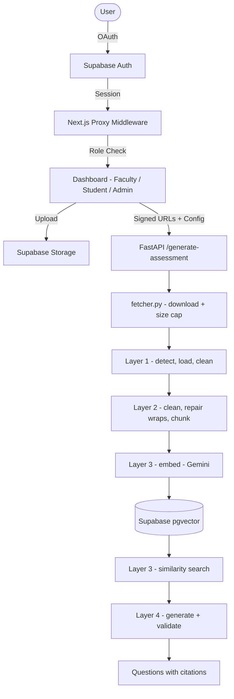

# Cognira
> AI‑powered adaptive assessment platform for automated quiz generation

## Overview
Cognira turns static course material (PDF, DOCX, PPTX) into multiple‑choice
quizzes. Faculty upload reference documents, configure quiz parameters, and a
RAG pipeline extracts, cleans, chunks, retrieves and finally generates
curriculum‑aligned questions. Students take the generated assessments.

**Current state:** the pipeline is built through extraction. Chunking,
retrieval and generation are not implemented — see *Pipeline status* below.

## Tech Stack
| Layer | Technology |
|-------|------------|
| **Frontend** | Next.js 16 (App Router), React 19, TypeScript, Tailwind CSS v4, Lucide icons, Google Fonts (Inter, Space Grotesk) |
| **Backend** | FastAPI, Python 3.13, LlamaIndex (`llama-index-core`, `llama-index-readers-file`), pypdf, python‑docx, python‑pptx, olefile, httpx |
| **OCR** (optional) | `google-genai` (Gemini vision), PyMuPDF for page rendering |
| **Embeddings** (optional) | `gemini-embedding-001` at 768 dimensions |
| **Vector store** (optional) | Supabase pgvector, via PostgREST |
| **Auth & Storage** | Supabase (PostgreSQL, Auth, Storage) |
| **Tests** | pytest |
| **Deployment** | Vercel (frontend) • Railway / Render (backend) |

No LLM provider is wired in for *generation* yet — Gemini is used only for
OCR, and only when `GEMINI_API_KEY` is set. Everything else works without it.

## Architecture
Client–server split, with the backend organised as numbered RAG layers.

1. **Authentication** – Google OAuth via Supabase.
2. **File upload** – validated (PDF/DOCX/PPTX/DOC/PPT/images ≤ 5 MB per file,
   5 MB cumulative) and stored in the private `faculty-documents` bucket. The
   browser never sends file bytes to the API — it sends a short‑lived signed
   URL per file.
3. **Extraction** (`services/extraction.py`) – downloads each signed URL,
   runs it through RAG Layer 1, chunks the result, then embeds and indexes it.
   One file at a time, failures isolated per file.
4. **Retrieval** (`services/rag/retrieval/`) – embeds a question and returns
   the closest chunks, scoped to the authenticated user and the files in the
   request.
5. **Quiz generation** (`services/quiz.py`) – searches per topic, writes
   questions from the retrieved passages, and validates them.
6. **Delivery** – not implemented.



### Pipeline status
| Layer | Module | Status |
|-------|--------|--------|
| 1 — Ingestion | `services/rag/ingestion/` | **Done** — detection, 6 loaders, uniform metadata |
| 1 — OCR | `services/rag/ingestion/ocr/` | **Done** — optional; images and scanned PDF pages |
| 2 — Cleaning | `services/rag/processing/cleaning/` | **Done** — normalisation + line-wrap repair |
| 2 — Chunking | `services/rag/processing/chunking/` | **Done** — sentence-aware splitting, small-unit merging |
| 3 — Embedding | `services/rag/embedding/` | **Done** — optional; Gemini, 768 dims |
| 3 — Vector store | `services/rag/store/` | **Done** — optional; Supabase pgvector |
| 3 — Retrieval | `services/rag/retrieval/` | **Done** — scoped similarity search |
| 4 — Generation | `services/rag/generation/` | **Done** — optional; structured output, validated |

### How Layer 1 works
`IngestionManager` is the only entry point. Given a path or bytes it:

1. **Detects the format** (`detector.py`) from magic bytes first, then MIME,
   then extension. ZIP‑ and OLE2‑based formats are ambiguous by signature
   alone, so the archive is opened and its internal layout (`word/` vs `ppt/`)
   settles it. A renamed file is still identified correctly.
2. **Looks up a loader** in `registry.py`. Loaders self‑register via the
   `@loader_for(...)` decorator at import time, which is why `manager.py`
   imports each loader module for its side effect. Adding a format means
   adding a loader file and one import — nothing existing changes.
3. **Builds a metadata template** — filename, type, size, and a `source_id`
   UUID that ties every page back to its file.
4. **Loads**, one `Document` per page (PDF) or slide (PPTX); DOCX, images and
   the legacy formats produce a single Document, since none stores page breaks.
   A PDF page whose text layer is nearly empty is a scan — it gets rendered
   and sent to OCR, if a provider is configured.
5. **Cleans and validates** via `BaseLoader.clean_and_validate`, the single
   place emptiness is decided, so all five loaders behave identically.

Metadata is normalised on the way out: reader‑internal keys are dropped
(`file_path` leaks the server's temp path, `text_sections` duplicates the
whole document text), everything non‑standard is flattened onto the top level
under an `x_` prefix as a scalar — nested values are rejected by Chroma,
Pinecone and pgvector alike — and `excluded_embed_metadata_keys` /
`excluded_llm_metadata_keys` are set so UUIDs and timestamps never reach an
embedding or a prompt.

### How Layer 2 works
Two problems, in opposite directions.

**PDF line wrapping.** A PDF records where each line was *printed*, not where
sentences end, so extraction returns a newline roughly every 90 characters —
mid-sentence — and a genuine paragraph break looks identical. A sentence-aware
splitter that trusts those newlines cuts in the wrong places. `repair_line_wraps`
rejoins a line to the one above unless there is evidence not to: the previous
line ended a sentence, the next starts a bullet or numbered item, either side
is blank, or the previous line is too short to be a wrapped one. It also
rejoins words hyphenated across a break. On the test lecture this takes a page
from 39 newlines to 11 — the actual paragraph count.

It is applied **only** to PDF, through `layout_aware_cleaner()`. In a slide or
a Word document a newline separates a bullet or a paragraph and means
something.

**Chunk size.** `DocumentChunker` splits long units and merges short ones:

- A PDF page or Word document is split with LlamaIndex's `SentenceSplitter`,
  which cuts between sentences rather than at a character count, with overlap
  so a fact on a boundary survives whole in one of the two chunks.
- A PowerPoint slide averages ~90 characters, about fifteen words. Alone it
  embeds to a vague vector that is weakly similar to everything and crowds out
  better matches, so consecutive slides are merged until they are worth
  retrieving — never across files, and the resulting chunk records the page
  range it covers so citations still work.
- An undersized trailing fragment is folded back into the previous chunk.

Sizes are in **words, not tokens** — see `app/config.py` for why. Chunk ids are
`<source_id>:<n>`, deterministic, so re-ingesting a file overwrites its chunks
in the vector store instead of doubling them.

### How Layer 3 works
An **embedding** is a list of numbers describing what a piece of text means:
two chunks about photosynthesis land near each other, one about mitosis lands
far away. Searching is then a distance calculation, which is why "how do plants
make food" finds a passage that never uses those words.

**Embedding** (`embedding/`) mirrors the OCR design — a protocol, a Gemini
implementation, and `get_embedder()` returning `None` when unconfigured. Two
methods rather than one, because a passage is embedded to be *found* and a
question to *find*; providers offer a task-type hint for each and using it
lifts retrieval quality for nothing. Chunks go out in batches and rate limits
are retried with backoff, since the free quota is per-minute and refuses a
burst rather than queuing it. Bad input is not retried.

**Storage** (`store/`) is the Supabase database already running, over
PostgREST rather than a Postgres driver — no new dependency, no connection
pool, no second set of credentials. PostgREST cannot express ordering by
vector distance, so similarity search goes through the `match_chunks` function
in migration 07. Writes are upserts on the chunk id, which is what makes
re-uploading a file replace its chunks instead of storing the document twice.

**Retrieval** (`retrieval/`) joins the two. Indexing is best-effort: a file
that was downloaded, parsed and chunked has already cost the user a wait, so a
failure to index reports itself per file rather than failing the upload.
Searching is not best-effort — a search that silently returns nothing is
indistinguishable from one that legitimately found nothing.

Two settings carry more weight than they look:

- **768 dimensions, not the model default of 3072.** A float is 4 bytes, so
  this is 3KB per chunk instead of 12KB — four times as many documents inside
  Supabase's free 500MB. The width is baked into the database column, so
  changing it means changing migration 07 and re-embedding everything.
- **A score floor.** Without one, a question about a topic absent from the
  material still returns the eight least-irrelevant chunks, and the model
  writes questions from them.

### How Layer 4 works
Retrieval-augmented generation is only worth the machinery if the questions
are actually tied to the material, so two things carry the weight.

**Passages are chosen per topic.** One search for "photosynthesis, genetics,
cell division" returns whatever sits nearest that blurred average — usually
eight chunks about one of the three. `quiz.py` searches each topic separately
and interleaves the results, so a truncated list still spans the syllabus.
Each batch of questions then sees a different window of passages, because
handing the same six chunks to every batch produces the same questions in
different words.

**Everything is checked afterwards.** Structured output guarantees the shape
of the model's reply and nothing about its sense. `validator.py` drops
questions with duplicate options, an out-of-range answer index, an "all of the
above", or a correct answer conspicuously longer than the distractors — the
single most reliable giveaway in a badly written question. It also drops
duplicates of earlier questions.

The check that matters most is **grounding**. A model that knows biology will
happily write a correct, well-formed question about content the teacher never
uploaded. So the prompt requires it to quote the sentence its answer rests on
— easy from the text, hard from memory — and the validator refuses any
question whose quote cannot be found in the passages. Matching is deliberately
loose on punctuation, since rejecting a sound question over a curly apostrophe
costs more than the leniency does.

When nothing relevant is found, that is reported rather than worked around.
Falling back to "use the material anyway" would paper over exactly the case
the score floor exists to catch.

### OCR
Optional and provider‑agnostic. `ocr/base.py` defines a one‑method protocol,
`ocr/gemini.py` implements it, and `ocr.get_provider()` returns `None` when no
key is configured — at which point images are refused with a message saying so
and every text‑bearing format carries on unaffected. Two guards matter:
`MAX_OCR_PAGES_PER_DOC` caps the paid calls one upload can trigger, and the
prompt instructs the model to transcribe rather than describe, since a
narrated image would otherwise become course material.

## Features
### Completed ✅
- Dark glass‑morphic UI with custom fonts and micro‑animations.
- Google OAuth with role‑based routing (faculty, student, admin).
- Multi‑format upload with progress UI and deletion.
- 7‑step quiz‑builder wizard (subject, audience, topics, objectives, type,
  count, time).
- Document ingestion: format detection, PDF/DOCX/PPTX/DOC/PPT/image loaders,
  uniform metadata, text normalisation.
- Optional OCR for images and scanned PDF pages, with a per‑document cap.
- PDF line‑wrap and hyphenation repair.
- Chunking: sentence‑aware splitting with overlap, small‑unit merging, page
  ranges for citation, deterministic chunk ids.
- Optional embedding and vector storage; `POST /search` for scoped retrieval
  with citations.
- MCQ generation with structured output, per-topic retrieval, and validation
  that drops ungrounded or badly formed questions.
- Per-user authentication: uploads, chunks and searches are scoped to the
  signed-in faculty member.
- `GET /limits` — upload rules served rather than hardcoded per client.
- `/generate-assessment` extraction path: signed‑URL download, server‑side
  size caps, per‑file error isolation.
- Test suite covering detection, ingestion, orchestration and the API.

### In Progress 🔄
- Nothing — the student-facing quiz player is the next piece of work.

### Planned 📋
- Persisting generated quizzes so students can take them.
- Question types beyond multiple choice.
- Student quiz player with timer and scoring UI.
- Analytics dashboard & adaptive difficulty engine.
- Admin control panel.
- LMS export formats (QTI, CSV).
- Async/parallel processing for large documents.

## Project Structure
Frontend and backend are separate deployables with no shared root, no shared
`node_modules`, and no shared env file.

```
mcqgenerator/
├─ frontend/                   # Next.js 16 → Vercel
│   ├─ app/                    # App Router
│   │   ├─ page.tsx            # Landing / login
│   │   ├─ auth/callback/      # Supabase OAuth callback
│   │   ├─ onboarding/         # Role‑selection flow
│   │   └─ dashboard/          # faculty / student / admin
│   ├─ components/             # Placement is by AUDIENCE — see components/README.md
│   │   ├─ ui/                 # Style‑only primitives
│   │   ├─ shared/             # Used by more than one role
│   │   ├─ faculty/            # Faculty‑only
│   │   └─ student/            # Student‑only
│   ├─ lib/                    # Runtime helpers & constants (role‑agnostic)
│   │   ├─ supabase/           # Browser + server clients
│   │   ├─ file-upload.ts      # Size caps, allowed types, validators
│   │   └─ quiz-config.ts      # Question type / count option lists
│   ├─ types/                  # database.ts, quiz.ts, upload.ts
│   ├─ proxy.ts                # Auth + role routing middleware
│   └─ .env.local              # NEXT_PUBLIC_* only (not committed)
├─ backend/                    # FastAPI → Railway / Render
│   ├─ app/
│   │   ├─ main.py             # App setup only — env, CORS, error handlers
│   │   ├─ config.py           # Every tunable, read once, in one place
│   │   ├─ auth.py             # Verifies the caller's Supabase token
│   │   ├─ routes.py           # Endpoints; validate and delegate
│   │   ├─ schemas.py          # API request/response shapes
│   │   └─ services/
│   │       ├─ extraction.py   # Orchestration: the API ↔ RAG seam
│   │       ├─ quiz.py         # The RAG loop: retrieve, generate, validate
│   │       └─ rag/
│   │           ├─ schemas.py            # Types shared by every layer
│   │           ├─ ingestion/            # Layer 1
│   │           │   ├─ manager.py        # Entry point
│   │           │   ├─ detector.py       # Magic bytes → MIME → extension
│   │           │   ├─ registry.py       # format → loader
│   │           │   ├─ base.py           # Loader contract + metadata hygiene
│   │           │   ├─ fetcher.py        # Signed‑URL download, size/time caps
│   │           │   ├─ salvage.py        # Text recovery for legacy binaries
│   │           │   ├─ exceptions.py     # User‑safe messages
│   │           │   ├─ ocr/              # Optional — provider protocol + Gemini
│   │           │   └─ loaders/          # pdf, docx, pptx, doc, ppt, image
│   │           ├─ embedding/            # Layer 3 — text to vectors
│   │           ├─ store/                # Layer 3 — Supabase pgvector
│   │           ├─ retrieval/            # Layer 3 — index and search
│   │           ├─ generation/           # Layer 4 — prompt, generate, validate
│   │           └─ processing/            # Layer 2
│   │               ├─ cleaning/          # Normalisation + line-wrap repair
│   │               └─ chunking/          # Splitting and merging
│   ├─ tests/                  # pytest — run with `pytest` from backend/
│   ├─ .env                    # Server‑side secrets (not committed)
│   └─ requirements.txt
├─ supabase/migrations/        # Numbered — run in order, 01 → 06
├─ docs/                       # project.md
└─ README.md
```

### Placement rules
Both a faculty and a student flow live in this repo, so the boundary that
matters is **who consumes a file**, not what it does:

- Anything imported by both roles belongs in `lib/`, `types/`,
  `components/ui/` or `components/shared/` — never inside
  `components/faculty/`.
- A cross‑role import (`app/dashboard/student` reaching into
  `components/faculty/`) means the file is in the wrong folder. Promote it.
- Role folders may only be imported by their own dashboard route.
- On the backend, routes validate and delegate; the work lives in
  `services/`. `services/rag/` imports no FastAPI — `services/extraction.py`
  is the only module that knows about both HTTP and the pipeline.

## Setup & Installation
1. **Clone the repository**
   ```bash
   git clone https://github.com/your-org/cognira.git
   cd cognira
   ```
2. **Backend** — start this first; the faculty dashboard calls it on port 8000.
   ```bash
   cd backend
   python -m venv .venv
   . .venv/Scripts/activate   # Windows
   pip install -r requirements.txt
   uvicorn app.main:app --reload
   pytest                     # 166 tests, no network or API key needed
   ```
3. **Frontend**
   ```bash
   cd ../frontend
   npm install
   npm run dev      # http://localhost:3000
   ```
4. **Supabase** – create a project, enable Auth & Storage, then run
   `supabase/migrations/01_schema.sql` → `09_chunk_scoping.sql` in order.
   **Migration 08 is a security fix that depends on nothing else — run it on
   any existing project, whether or not the RAG layers are in.**

## API / Endpoints
| Method | Path | Description |
|--------|------|-------------|
| `GET`  | `/` | Liveness check — `{ status: "ok" }`. |
| `GET`  | `/limits` | Upload caps, allowed extensions, and whether OCR is on. |
| `POST` | `/search` | Question + `sourceIds` → matching chunks with citations. |

`/generate-assessment` and `/search` require a Supabase access token in an
`Authorization: Bearer` header whenever `SUPABASE_URL` is configured. Without
that variable the API is open, which is correct for local development and
wrong for anything a second person can reach.
| `POST` | `/generate-assessment` | Takes `sourceType` + files/text + quiz config; downloads each signed URL, extracts text, returns one row per source. |

Routes are defined in `backend/app/routes.py`; interactive docs at
`http://localhost:8000/docs`.

A per‑file failure is a **row**, not an HTTP error — the response is `200`
with `ok: false` and a message on the affected source, because the other
files in the batch may have succeeded. Only a malformed request fails outright.

`SourceResult` carries `chars`, not the extracted text. The browser only ever
displayed the length, and the text is needed server‑side for generation
anyway. It currently lives only for the duration of the request — persisting
it is a decision the retrieval layer forces.

## Environment Variables
Two files, no overlap. Neither is committed.

See `backend/.env.example` for the full annotated list.

| File | Variable | Description |
|------|----------|-------------|
| `backend/.env` | `ALLOWED_ORIGINS` | Comma‑separated CORS origins. Defaults to `http://localhost:3000`. |
| `backend/.env` | `GEMINI_API_KEY` | **Optional.** Enables OCR for images and scanned PDFs. |
| `backend/.env` | `GEMINI_OCR_MODEL` | Vision model. Defaults to `gemini-2.0-flash`. |
| `backend/.env` | `MAX_OCR_PAGES_PER_DOC` | Cap on OCR calls per document. Defaults to 20. |
| `backend/.env` | `CHUNK_SIZE_WORDS` | Chunk size in words. Defaults to 300 (≈400 tokens). |
| `backend/.env` | `CHUNK_OVERLAP_WORDS` | Overlap between chunks. Defaults to 50. |
| `backend/.env` | `MIN_MERGE_WORDS` | Units smaller than this are merged. Defaults to 80. |
| `backend/.env` | `SUPABASE_URL` | **Optional.** Enables the vector store. |
| `backend/.env` | `SUPABASE_SERVICE_ROLE_KEY` | **Optional.** Bypasses RLS — server-side only, never the browser. |
| `backend/.env` | `EMBED_DIMENSIONS` | Vector width. Defaults to 768; must match migration 07. |
| `backend/.env` | `RETRIEVAL_TOP_K` | Chunks returned per search. Defaults to 8. |
| `backend/.env` | `RETRIEVAL_MIN_SCORE` | Similarity floor. Defaults to 0.35. |
| `frontend/.env.local` | `NEXT_PUBLIC_SUPABASE_URL` | Supabase project URL. |
| `frontend/.env.local` | `NEXT_PUBLIC_SUPABASE_ANON_KEY` | Supabase anon key. |
| `frontend/.env.local` | `NEXT_PUBLIC_API_URL` | Deployed backend address. |

The backend needs no API key to run — only to do OCR. Only `NEXT_PUBLIC_*`
values reach the browser. The backend reads its `.env` once, in `app/main.py`,
and every tunable is then read from `app/config.py`.

## Known Issues & Limitations
- **Generated quizzes are not saved.** They are returned in the response and
  lost when the page is closed. Students cannot take them yet.
- **Generation runs inside the upload request.** Download, extract, OCR,
  chunk, embed, retrieve and generate all happen before the response, which
  can take tens of seconds. This is the first thing to move to a background
  job.
- **Only multiple-choice is implemented.** The quiz builder offers other
  question types; they all produce MCQs today.
- **The free Gemini quota has different data terms.** Under Google's API
  terms, content sent on the unpaid quota is used to improve Google's products
  and may be read by human reviewers; content on the paid quota is not.
  Uploaded course material goes through this path. Enabling billing on the
  same key changes the terms with no code change.
- **Embedding dimensions are baked into the database.** `EMBED_DIMENSIONS`
  must match `vector(768)` in migration 07. Changing it means changing both
  and re-embedding every document — vectors of different widths, or from
  different models, are not comparable and comparing them fails silently.
- **Indexing runs inline with upload.** It adds an API round trip per batch of
  chunks to the request. Acceptable at 5MB per upload; the first thing to move
  to a background job if uploads get larger.
- **OCR is optional and off by default.** Without `GEMINI_API_KEY`, images are
  refused with a message saying text recognition isn't switched on, and a
  scanned PDF fails as empty. With it set, both work — at the cost of one
  vision call per scanned page, capped by `MAX_OCR_PAGES_PER_DOC`.
- **`.doc` and `.ppt` are salvage, not parsing.** Where Microsoft Word or
  `antiword` is available a .doc is extracted properly; on a deployed host
  neither exists, so both formats fall back to recovering readable runs from
  the binary. Non‑Latin scripts are not recovered and slide/section structure
  is lost. Re‑saving as .docx or .pptx gives a complete parse.
- Documents are processed sequentially — no batching, queue or parallelism.
  Extraction is the only work in the request today; revisit when an LLM call
  joins it.
- The extracted text lives only for the duration of the request. Where it
  should persist is a decision the retrieval layer forces.
- `GET /limits` exists so the frontend can stop hardcoding the caps, but
  `frontend/lib/file-upload.ts` does not consume it yet.
- **Chunk size is set for an 8k-token embedding model.** If Layer 3 picks a
  model with a 256-token window (`all-MiniLM` and similar), set
  `CHUNK_SIZE_WORDS` to about 150 or the tail of every chunk is silently
  truncated at embedding time.
- Chunking runs inline with extraction. It is pure CPU with no network call,
  so this is fine today; revisit if extraction ever moves to a queue.

## Changelog
### v1.6 — 2026‑09‑07
- **Security: faculty could read and delete each other's uploaded files.** The
  storage policies checked that the caller was faculty but never that they
  owned the file. Migration 08 adds a path-ownership check to SELECT, DELETE
  and INSERT — the last so a file cannot be planted in another user's folder.
  08 depends only on 01-06, so it applies to any project as it stands.
- **Security: the admin role could be self-assigned.** `set_profile_role`
  accepts any `user_role`, and the enum includes `admin`, so a direct RPC call
  from a fresh account granted admin. Migration 08 whitelists the
  self-selectable roles — a whitelist, so the next privileged role added to
  the enum is not self-assignable by default.
- **Security: retrieval was scoped only by client-supplied source ids.**
  `match_chunks` now filters by owner (migration 09), and the owner comes
  from a verified token rather than the request body.
- Added `app/auth.py`: Supabase token verification with a short cache.
  Authentication is required whenever `SUPABASE_URL` is set.
- Added RAG Layer 4 (`generation/`): prompt construction, structured output,
  and a validator that drops ungrounded, malformed or giveaway questions.
- Added `services/quiz.py`: per-topic retrieval, interleaving, batch windows.
- The dashboard now sends its Supabase session token with each request.

### v1.5 — 2026‑09‑07
- Added RAG Layer 3: embeddings (`embedding/`), a Supabase pgvector store
  (`store/`) and retrieval (`retrieval/`), each optional and provider-swappable.
- Added `supabase/migrations/07_chunks.sql` — pgvector, the `document_chunks`
  table, an HNSW cosine index, RLS policies, and the `match_chunks` function.
- Added `POST /search`; `/generate-assessment` now returns `sourceId` and
  whether each file was indexed.
- Chose 768 dimensions over the model default of 3072 — four times as many
  documents inside Supabase's free tier, for negligible quality loss at this
  corpus size.
- Fixed the OCR model default: `gemini-2.0-flash` has been retired by Google,
  so the configured default would have failed at the first request.

### v1.4 — 2026‑09‑07
- Added RAG Layer 2 chunking (`processing/chunking/`): sentence-aware
  splitting with overlap, merging of undersized units such as slides, page
  ranges on merged chunks, folded short tails, and deterministic chunk ids.
- Added PDF line-wrap and hyphenation repair, applied only to fixed-layout
  sources via `layout_aware_cleaner()`. `TextCleaner` now accepts extra rules.
- `/generate-assessment` reports a chunk count per source.
- Chunk bookkeeping is excluded from the embedding but page ranges are kept
  visible to the LLM, so citations survive merging.

### v1.3 — 2026‑09‑07
- Added an optional OCR layer: provider protocol, Gemini implementation, an
  image loader for PNG/JPG/WEBP/GIF/BMP/TIFF, and a scanned‑page fallback that
  renders and OCRs PDF pages with no text layer. Capped per document.
- Fixed `.doc` in deployment — added a pure‑Python OLE2 salvage fallback after
  win32com and antiword, so the format no longer works locally and fails in
  production. Salvage is now shared with `.ppt` in `ingestion/salvage.py`.
- Flattened `custom_metadata` to scalar `x_`‑prefixed keys; the nested dict
  would have been rejected by every common vector store at insert time.
- Added `app/config.py` and `GET /limits` — the upload caps were written down
  in three places, each with a comment asking the reader to sync the others.
- Added `backend/.env.example`.

### v1.2 — 2026‑09‑07
- Wired Layer 1 into `/generate-assessment`; file uploads no longer 501.
- Added `fetcher.py` (signed‑URL download, streamed size cap, timeouts) and
  `services/extraction.py` (per‑file isolation, image guard, server‑side
  cumulative cap).
- Fixed `.docx` ingestion — LlamaIndex's `DocxReader` requires `docx2txt`,
  which is not a dependency, so every `.docx` upload failed. Now reads via
  `python-docx` directly and picks up table text.
- Added metadata hygiene: reader noise dropped, embed/LLM exclusion lists set.
- Rewrote `.ppt` text recovery, which previously returned binary mojibake that
  passed the emptiness check.
- Added a test suite (`backend/tests/`).
- Corrected this document — the previous version described a Gemini Vision OCR
  pipeline and a `services/extraction/` + `app/core/` + `app/api/routes/`
  layout, none of which exist in the codebase.

### v1.0 — 2026‑06‑22
- Restructured `PROJECT.md` to the new canonical template.

## Notes for Future Me
- **The frontend still hardcodes the upload caps.** `GET /limits` is there to
  replace that; wiring it up means making the upload widget's validation async.
- **Chunk size must be checked against the embedding model** chosen in Layer 3.
  The default assumes a large context window; a 256-token model needs roughly
  half the current size.
- **Where extracted text lives** is now answered: chunks are written into
  Supabase at extraction time, keyed by their deterministic ids.
- **Model names expire.** `gemini-2.0-flash` was a default here until Google
  shut it down, and a dead name fails at the first request rather than at
  deploy. Check the model list when OCR or embeddings start erroring.
- **Enforcement belongs in the database.** Both security bugs fixed in v1.6
  were correct in the frontend and unenforced in Postgres. The onboarding
  screen only ever offered student and faculty; the type even carried a
  comment saying admins are assigned manually. None of that is a control.
- **Tune the chunker on real course material, not fixtures.** The knobs are
  all in `app/config.py`; the signal to watch is whether retrieved chunks
  answer the question on their own.
- **Sequential processing** is fine while extraction is the only work. Once an
  LLM call joins the request, revisit — a background queue will be needed.
- **Security:** Supabase RLS policies are critical; any new storage bucket
  must inherit the same user‑scoped policy.
