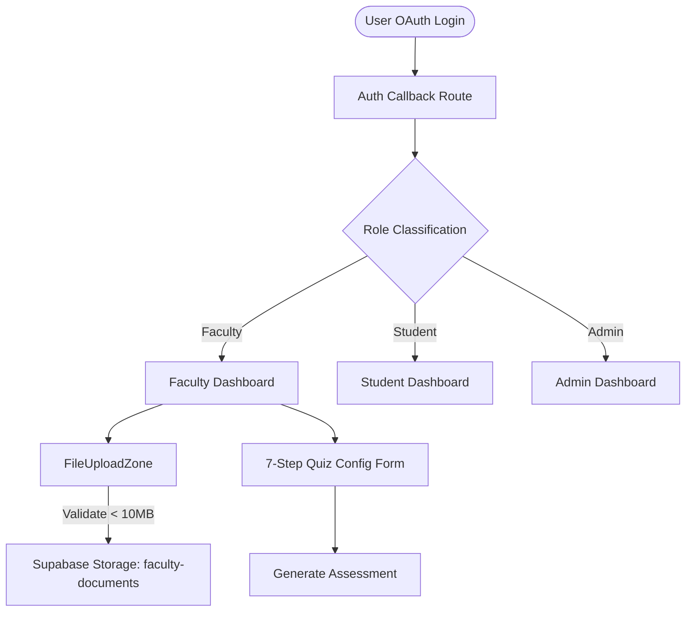

# Cognira Project Status Log & Specification

Cognira is an AI-powered adaptive assessment platform designed to transform traditional static quizzes into personalized learning experiences. This document serves as the single source of truth for the project's purpose, current architecture, roadmap, technical decisions, and operational tasks.

---

## 🎯 Project Purpose and Goals

### Core Purpose
Cognira simplifies and automates the process of quiz creation, delivery, and tracking. By using AI and cloud integrations, the platform enables faculty members to generate highly context-relevant, curriculum-aligned Multiple Choice Questions (MCQs) from raw reference documents or text notes, while allowing students to take these assessments dynamically.

### Key Goals
* **Time Savings**: Save educators hours of manual work in constructing quizzes and assessments.
* **Visual Excellence**: Offer a modern, high-fidelity dark glassmorphic interface that delivers a premium user experience.
* **Secure Scalability**: Utilize Supabase Auth, Storage, and Database features with strict Row-Level Security (RLS) to keep user files and assessments isolated.
* **Adaptive Learning**: Serve dynamic student quizzes that can adapt based on target audience details and objectives.

---

## 🏗️ Current Architecture and Workflow

The system is built as a single-page app (SPA) experience inside Next.js, powered by Supabase for authentication, storage, and database triggers.



### 1. Authentication & Role-Based Security Pipeline
* Users register or sign in via Google OAuth.
* The authentication callback (`app/auth/callback/route.ts`) maps the verified email against specific roles (`admin | faculty | student`) in the database.
* The routing middleware (`proxy.ts`) acts as a secure route proxy, redirecting authenticated users to the correct folder path (`/dashboard/${role}`) and instantly blocking unauthorized cross-dashboard navigation.

### 2. Document Ingestion & Quiz Configuration Workflow
* **Tab Selection**: Faculty members choose between uploading reference files or pasting raw text notes (which must be at least 50 words).
* **Validation**: Files are checked in the browser for allowed extensions (`.pdf`, `.docx`, `.pptx`, `.png`, `.jpg`, `.jpeg`) and file size limit (max 10 MB).
* **Supabase File Upload**: Valid files are stored under `{userId}/{timestamp}_{randomString}.{ext}` inside the private `faculty-documents` storage bucket. An async progress state runs in the browser during upload. Deleting a file in the UI calls Supabase to delete it from the storage bucket.
* **Assessment Configuration**: The user completes a 7-step setup form, configuring variables like Subject, Target Audience (free-text detail), Focus Topics, Learning Objectives, Question Type, Count, and Time Limit.
* **Guard Lock**: The "Generate Assessment" button is disabled until all inputs are complete.

---

## ✅ Features Completed

### Brand & Layout Refinement
* **Rebranding**: Rebranded the entire codebase from "Synaptiq" to **Cognira**.
* **Visual Design**: Implemented a dark glassmorphic UI using Tailwind CSS v4, custom fonts (`Inter` & `Space Grotesk`), grid layouts, custom SVG noise overlays, and floating background gradient orbs.
* **Casing Route Fix**: Renamed directory routing to lowercase `/app/dashboard` to resolve filesystem casing routing bugs.
* **Overlays**: Added theme-aligned interactive modals for Privacy Policy, Terms of Service, and Support.

### Security & Authentication
* **Proxy Middleware**: Created `proxy.ts` to intercept user requests and dynamically secure paths.
* **Google OAuth Callback**: Created `/auth/callback` token exchange with server-side database error logging to prevent raw error details from leaking via URLs.
* **Role Mappings**: Configured explicit email checks for roles (e.g. mapping `hardikjalan2005@gmail.com` to `faculty` for dev/staging tests).

### Faculty Quiz Builder
* **Split Layout Refactor**: Shifted from a cluttered split-pane design to a flowing single-column wizard for better readability.
* **Modular Components**: Developed isolated UI components under `components/faculty/` for type validation, step numbering labels, and drag-and-drop targets.
* **Supabase Storage Integration**:
  * Set up `faculty-documents` private bucket.
  * Added `supabase/storage.sql` containing RLS policies to restrict CRUD access to the file owner (`auth.uid()`).
  * Programmed progress states, file removal callbacks, and error reporting.

---

## 🚧 Features in Progress

* **AI Quiz Generation API**: Connecting the mock `handleGenerate` hook to a live endpoint. This requires backend text extraction scripts for uploaded PDFs, DOCX, and PPTX documents, feeding the compiled text and configuration settings to the generation model, and returning structured questions.

---

## 📋 Planned Features

* **Quiz Taking Console (Student)**: Interactive assessment engine with timers, auto-saving draft answers, grading math, and score submissions.
* **Adaptive Question Selection**: Algorithms to scale question difficulties dynamically according to student performance.
* **Faculty Performance Analytics**: Interactive charts showing average class score, difficulty analysis per question, and historical exam statistics.
* **Admin Control Panel**: Interface to manage user permissions, database tables, and system tokens.

---

## 🛠️ Technical Decisions and Rationale

* **Next.js 16 + React 19 + TypeScript**: Modern framework selections enabling React Server Components (RSC), hydration optimizations, and strict type checking.
* **Tailwind CSS v4**: Utility-first CSS using direct `@theme` styles. Avoids maintaining separate configuration files and keeps the style system portable.
* **Supabase Server-Side Session Handling**: Handles session cookies, OAuth code exchanges, and database triggers out of the box, reducing backend security maintenance.
* **Storage Path Isolation (`{userId}/{fileName}`)**: Namespacing files under user IDs ensures clean folder segregation on Supabase Storage and simplifies ownership validation in RLS.
* **Browser-Side Upload Progress Animation**: Supabase JS client lacks native browser upload progress callbacks. We implemented a visual interval ticker that smoothly animates progress up to 85% until the Promise resolves, creating a responsive user experience.
* **Elimination of Difficulty/Bloom's Taxonomies (Requested)**: Simplified the generator configuration variables to focus strictly on MCQ generation and reduce configuration fatigue.

---

## 📂 Folder Structure and Tech Stack

### Tech Stack
* **Core**: Next.js 16 (App Router), React 19, TypeScript
* **Database & Auth**: Supabase (PostgreSQL)
* **File Storage**: Supabase Storage (`faculty-documents` bucket)
* **Styling**: Tailwind CSS v4
* **Icons**: Lucide React

### Folder Structure
```text
mcqgenerator/
├── app/
│   ├── auth/
│   │   └── callback/
│   │       └── route.ts         # Secure code exchange & role classification handler
│   ├── dashboard/
│   │   ├── admin/
│   │   │   └── page.tsx         # Admin Dashboard placeholder
│   │   ├── faculty/
│   │   │   └── page.tsx         # Faculty Dashboard main page & upload orchestrator
│   │   └── student/
│   │       └── page.tsx         # Student Dashboard placeholder
│   ├── globals.css              # Global styles, scrollbars, and keyframe animations
│   ├── layout.tsx               # Injects fonts, layouts, and page SEO metadata
│   └── page.tsx                 # Main visual landing page, login panel & policy modals
├── components/
│   └── faculty/
│       ├── FileUploadZone.tsx   # Interactive drag-and-drop file target & progress lists
│       ├── form-fields.tsx      # Stylized step labels and inputs (FormInput, SectionLabel)
│       └── types.ts             # Shared typescript types, validation functions, & constants
├── lib/
│   └── supabase/
│       └── client.ts            # Resilient client browser instance helper
├── supabase/
│   ├── schema.sql               # Database schema definition (tables & roles)
│   ├── policies.sql             # Row Level Security (RLS) policies
│   ├── triggers.sql             # Database triggers and function for signup automation
│   └── storage.sql              # Storage bucket RLS policies for faculty documents
├── .env.local                   # Client API settings (not committed)
├── proxy.ts                     # Next.js 16 Route Security Middleware Proxy
└── package.json                 # Next.js 16, React 19 & Supabase packages
```

---

## 🗄️ Database and API Design

### Database Schema

#### `public.profiles`
Tracks authenticated user roles mapping directly from Supabase Auth.
* `id` (uuid, Primary Key, references `auth.users.id`)
* `name` (text, user's display name)
* `email` (text, user's login email)
* `role` (user_role enum: `'student' | 'faculty' | 'admin'`)
* `avatar_url` (text, Google profile image link)
* `created_at` (timestamp)

#### Storage Bucket: `faculty-documents`
Private bucket. Access policies are stored in `supabase/storage.sql` and enforce:
* `INSERT`: Allowed if user is authenticated and path starts with `{auth.uid()}/`.
* `SELECT` / `DELETE`: Allowed only if the user matches the owner ID in the path prefix.

---

## 🐛 Tasks, Bugs, and Blockers

### Active Tasks
* [ ] Integrate document text parser API (PDF/Word/PPTX text extraction).
* [ ] Wire the quiz generation wizard to an LLM provider (e.g., Google Gemini API).
* [ ] Replace student dashboard placeholder with quiz catalog and quiz taking portal.
* [ ] Implement grading table schema to record and compute quiz metrics.

### Bugs Log
* **casing_error (Fixed)**: Dashboard router crash caused by upper/lowercase mismatch in directory folder. Fixed by renaming to `/app/dashboard`.
* **label_typescript_error (Fixed)**: Compilation bug where `SectionLabel` component was passed an invalid parameter. Fixed by removing the parameter from all instances.

### Current Blockers
* *None.*

---

## 💡 Future Improvements and Ideas

* **LMS Exports**: Export assessment questions directly to standard formats like QTI, CSV, or PDFs for integration into platforms like Canvas or Moodle.
* **Multilingual Generation**: Generate and take quizzes in languages other than English.
* **Draft Auto-Saving**: Save quiz builder progress in local storage so page refreshes do not clear the form.

---

## 🗺️ Project Roadmap

```text
  Phase 1             Phase 2             Phase 3             Phase 4             Phase 5
  [Brand & Auth]  ->  [Quiz Config]   ->  [AI Integration] ->  [Student Engine] ->  [Analytics & Admin]
  (Status: Done)      (Status: Done)      (Status: Current)   (Status: Planned)   (Status: Planned)
```
* **Phase 1: Brand & Authentication** (Completed)
* **Phase 2: Faculty Document Ingestion & Quiz Configuration** (Completed)
* **Phase 3: AI Engine Integration & Text Extraction** (In Progress)
* **Phase 4: Student Quiz Player & Timer Engine** (Planned)
* **Phase 5: Analytics, Adaptive Scoring & Admin Control** (Planned)
